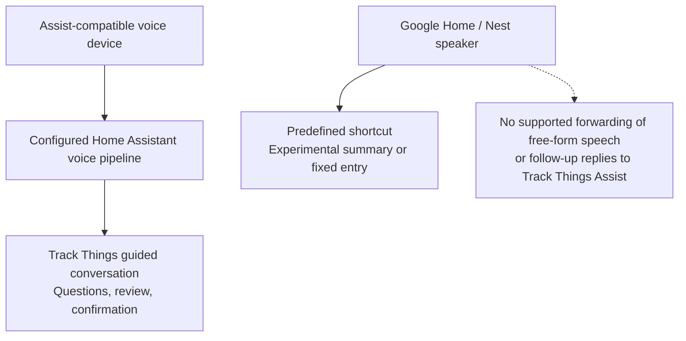
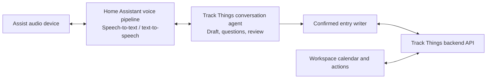

# Track Things for Home Assistant

Connect your [Track Things](https://track-things.com) workspace to Home Assistant
to browse recorded events, run entry-creation actions, and use guided Assist
conversations to record information. This repository contains the custom Home
Assistant integration.

**Voice support requires additional setup. Google Home/Nest speakers connected
to Home Assistant cannot carry the full Track Things conversation. For hands-free
room use, you need a separate Assist-compatible voice device and configured
speech services. Live voice-device verification remains pending.**

[Installation and connection](#connect-track-things-to-home-assistant) ·
[Voice setup](#set-up-voice-separately) ·
[Limitations](#current-bottlenecks-and-limitations) ·
[Technical documentation](#technical-documentation)

## What the integration provides

The Track Things integration lets Home Assistant read your recorded-entry calendar,
answer calendar questions, and create entries in existing manual trackers.
Through the **Track Things** Assist conversation agent, you can start a draft,
answer questions about its subject and details, review the result, and explicitly
confirm before it is saved. The guided conversation supports English, Polish, German,
and French using supported phrases and step-by-step questions.

The integration also provides a read-only workspace calendar and actions for
reading daily entries, refreshing data, and recording entries from automations.
See the [calendar guide](docs/CALENDAR.md) and
[entry-creation action guide](docs/CREATE_ENTRY_ACTION.md).

## Requirements

- Home Assistant **2026.9.0 or newer**.
- A Track Things account with access to the workspace you want to connect.
- Existing trackers and assigned subjects (the people, pets, or things your
  entries describe). Guided entry creation supports active manual trackers.
- Network access from Home Assistant to the Track Things service.
- For spoken conversations: a configured Assist voice pipeline and a compatible
  microphone/speaker device. Calendar access and automation actions do not
  require voice hardware.

## Connect Track Things to Home Assistant

1. Confirm that your Track Things account can access the workspace and trackers
   you want to use in Home Assistant.
2. Download the
   [source of this repository](https://github.com/MSpiechowicz/track-things-home-assistant)
   and copy its `custom_components/track_things` directory into your Home
   Assistant configuration directory under `custom_components/track_things`.
   Keep the bundled `brand` directory, then restart Home Assistant.
3. In Home Assistant, open **Settings → Devices & services → Add integration →
   Track Things**, then choose **Connect with your Track Things account**.
4. Keep that setup window open, follow the Track Things link, and sign in with
   Google, GitHub, or your usual sign-in method. Enter the code displayed in
   Home Assistant and approve your connection; the code expires after ten minutes.
5. Return to Home Assistant, select your workspace, and select the desired
   trackers in the integration options. The standard connection uses the hosted
   Track Things service automatically; you do not need to copy passwords or
   access tokens into configuration files.
6. Check that the workspace calendar is available before configuring voice.
   You can revoke the connection later from **Account → Security → Manage Home
   Assistant connections** in Track Things.

See the [account setup guide](docs/ACCOUNT_SETUP.md)
for complete connection and recovery instructions, including connecting to a
custom server through **Advanced setup**.

## Set up voice separately

You need both a running Home Assistant instance and a way to speak directly to
Assist. For hands-free room use, use a separate Assist-compatible microphone and
speaker device, such as Home Assistant Voice Preview Edition or a supported
ESPHome voice satellite. A Google Home/Nest speaker does not fill that role for
this integration. You can also try Assist through the Home Assistant companion
app on a phone, or test with text before buying dedicated hardware. See
[Home Assistant's supported Assist options](https://www.home-assistant.io/voice_control/).

A **voice pipeline** is the set of services that turns your speech into text,
passes it to Track Things, and reads the reply aloud.

1. In **Settings → Voice assistants**, add or edit a dedicated assistant and
   select **Track Things** as its conversation agent. Disable **Prefer handling
   commands locally** for this pipeline so replies reach the Track Things agent.
2. Select a supported language and configure speech-to-text and text-to-speech
   providers for it. Follow Home Assistant's
   [local voice setup](https://www.home-assistant.io/voice_control/voice_remote_local_assistant/)
   or [Home Assistant Cloud setup](https://www.home-assistant.io/voice_control/voice_remote_cloud_assistant/).
   The standard guided Track Things assistant needs no Gemini key or AI
   subscription; speech services have their own requirements and possible costs.
3. Assign that assistant to your Assist-compatible voice device. Keep the same
   assistant and conversation across follow-up answers.
4. Test in Assist with text first: for a tracker named `Headache`, try
   `log Headache`, answer the questions, use `review` to review the draft, then
   `confirm` to save it. Verify the entry in the web app before testing the same
   flow with your microphone and spoken replies.

See the [Track Things Assist guide](docs/ASSIST_CONVERSATION.md)
for languages, aliases, default subjects, and conversation controls.

## Current bottlenecks and limitations



The Assist route is implemented and tested with automated text conversations;
it is still awaiting end-to-end voice-device verification.

- **Google Home + Home Assistant does not support the full Track Things voice
  dialogue.** The current Google/Nest shortcut path does not forward arbitrary
  speech or follow-up answers to the Track Things Assist agent. Linking Google
  Home, exposing a script, or playing a spoken response does not bridge that gap.
- **Google speaker support is limited to predefined shortcuts.** The integration
  includes [daily-summary](docs/GOOGLE_DAILY_SUMMARY.md)
  and [fixed-entry](docs/GOOGLE_FIXED_ENTRY.md)
  experiments. A zero-entry summary proof of concept passed, but broader device
  acceptance and fixed-entry real-device verification remain pending. These are
  not interactive entry-creation conversations.
- **Voice hardware and speech setup are additional work.** A running Home
  Assistant server alone is insufficient for hands-free voice. You must provide
  an Assist-compatible microphone/speaker device and working speech services.
  Recognition quality, response time, and follow-up listening depend on that setup.
- **End-to-end voice validation is still pending.** Automated text replays cover
  guided questions and confirmed saves, but live microphone, speech-to-text,
  text-to-speech, and follow-up listening checks remain deferred. Spoken controls
  inside free-text answers also remain unverified.
- **Voice writes use existing manual trackers.** Set up tracker fields and subjects
  in the web app first. Trackers populated by integrations, calculated trackers,
  and archived trackers cannot receive voice-created entries.
- **A working service connection is required.** Local speech processing does not
  make calendar queries or entry saving available offline.

The integration is under active development. Treat the linked integration guides
as the source of truth for supported behavior and verification status.

## Technical documentation

This section covers the integration's architecture, development, and maintenance.
The installation steps above are sufficient for connecting an account; the
following details are for integration contributors and maintainers.

### Connection architecture

The integration runs inside Home Assistant and calls the Track Things backend
using an authenticated account connection. The backend validates and stores
entries. Home Assistant owns audio capture, speech recognition, speech synthesis,
and playback; the Track Things conversation agent receives text and returns
replies and follow-up signals.



Each configured integration entry selects an account and workspace. Tracker
options control which trackers are available; metadata is refreshed every five
minutes. Voice writes use selected active manual trackers with resolvable schemas
and valid subject assignments. See [metadata discovery](docs/METADATA.md).

### Feature and implementation guides

| Area | Documentation |
| --- | --- |
| Account connection and recovery | [Account setup](docs/ACCOUNT_SETUP.md), [diagnostics](docs/DIAGNOSTICS.md) |
| Calendar reads and questions | [Calendar](docs/CALENDAR.md), [calendar actions](docs/CALENDAR_ACTIONS.md), [calendar conversations](docs/CALENDAR_CONVERSATION.md) |
| Entry creation and naming | [Create-entry action](docs/CREATE_ENTRY_ACTION.md), [name-based actions](docs/NAME_BASED_ACTIONS.md) |
| Guided conversations | [Assist setup](docs/ASSIST_CONVERSATION.md), [phrase adapter](docs/CONVERSATION_ADAPTER.md), [voice aliases and default subject](docs/VOICE_OPTIONS.md) |
| Experimental Google shortcuts | [Connection checklist](docs/GOOGLE_HOME_SETUP.md), [daily summary](docs/GOOGLE_DAILY_SUMMARY.md), [fixed entry](docs/GOOGLE_FIXED_ENTRY.md) |
| Optional natural wording | [Gemini proof of concept](docs/GEMINI_ASSIST.md) — English request translation; not required for the standard agent |
| API and validation | [API client](docs/API_CLIENT.md), [schema validation](docs/SCHEMA_VALIDATION.md), [calendar mapping](docs/CALENDAR_MAPPING.md) |

See the [implementation plan](docs/IMPLEMENTATION_PLAN.md) and
[project board](https://github.com/users/MSpiechowicz/projects/4) for ongoing work.

### Development

Use **Python 3.14.2 or newer**. The minimum Home Assistant version is **2026.9.0**.
The custom-component test harness pins Home Assistant and its testing dependencies
as a compatible set; do not override its Home Assistant pin independently.

```sh
python -m venv .venv
source .venv/bin/activate
python -m pip install -e ".[test]"
python -m pip check
python -m pytest -q tests/test_init.py tests/test_source_quality.py
python -m ruff check .
python -m ruff format --check .
python scripts/check_file_sizes.py
python -m pytest -q
```

Tests load the real custom component through Home Assistant and use mock config
entries and real config flows; HTTP responses are synthetic. No running backend, credentials,
or microphone is required. Internet
sockets are disabled during tests, with Unix sockets allowed for the event loop.
Home Assistant's fixture teardown also checks for leaked tasks and resources.

To reproduce the minimum-version CI job, create a second environment:

```sh
python -m venv .venv-minimum
source .venv-minimum/bin/activate
python -m pip install -e ".[test]" -c constraints/minimum.txt
python -m pip check
python -m pytest -q
```

CI runs these checks on pushes, pull requests, and weekly. Its minimum job pins
Home Assistant 2026.9.0 with harness 0.13.363; its latest job resolves the newest
stable compatible harness (2026.9.1 / 0.13.364 when bootstrapped). Review future
Python/runtime requirements when advancing the compatibility baseline. Updating
the harness and Home Assistant must be done together.

Keep handwritten source and test files at or below **500 physical lines**. Split
by responsibility instead of compressing code. The checker covers Python,
JavaScript/TypeScript, CSS, and shell files, including untracked files. It excludes
virtual environments, caches, build outputs, vendored/generated directories, and
symlinks. JSON data, Markdown documentation, and other assets are not source files
for this check. Use `python -m ruff format .` to format changed Python files.

### Disposable-instance smoke test

Add Track Things through Settings → Devices & services → Add integration.
Choose the account connection option and sign in with Google, GitHub, or your
usual method in the browser. The production backend URL is automatic. See
[account setup](docs/ACCOUNT_SETUP.md) for approval, revocation, and advanced setup.
Empty YAML remains a development-only loading check and takes no account
settings. Do not put tokens or passwords in YAML.

After installing the minimum-version test environment above, run the following
from the repository root. The directory created here is disposable and contains
Home Assistant state; never commit its contents.

```sh
smoke_config=$(mktemp -d)
mkdir -p "$smoke_config/custom_components"
cp -R custom_components/track_things "$smoke_config/custom_components/"
printf 'track_things: {}\nhttp:\n  server_host: 127.0.0.1\n  server_port: 18123\n' \
  > "$smoke_config/configuration.yaml"
python -m homeassistant --config "$smoke_config" --script check_config
python -m homeassistant --config "$smoke_config" --verbose
```

Wait for `Setup of domain track_things took ... seconds`, then press Ctrl+C.
Run the final command a second time and confirm the integration loads again with
no import/setup errors. Home Assistant's standard warning about an untested custom
integration is expected. First startup downloads Home Assistant's additional
runtime dependencies and can take a few minutes; do not use `--skip-pip` in a
fresh environment. Its HTTP server is bound to loopback on port 18123. Track
Things adds an account config flow and a read-only calendar for configured workspaces. The lifecycle tests
cover authenticated config-entry setup/reload/unload.

### Automatic versioning

After both CI jobs pass on a push to `main`, the version job reads Conventional
Commits since the highest reachable stable `vX.Y.Z` tag:

- `feat:` increments minor.
- `fix:`, `perf:`, and `revert:` increment patch.
- `!` in a Conventional Commit header or a `BREAKING CHANGE:` /
  `BREAKING-CHANGE:` footer increments major, including before version 1.0.
- Documentation, tests, chores, refactors, and unrecognized subjects do not bump
  unless they declare a breaking change. The highest increment wins.

The job updates `project.version` in `pyproject.toml` and `version` in the Home
Assistant manifest together, commits as `github-actions[bot]`, and atomically
pushes the commit and annotated `vX.Y.Z` tag. Before the first tag it uses the
stored `0.1.0` as the base and examines all commits; the initial `feat:` therefore
produces `0.2.0`. Keep both files synchronized and do not bump them manually.

Preview locally without modifying files:

```sh
python scripts/semantic_version.py
```

PRs and branch builds only preview. When squash-merging, use a Conventional
Commit PR title (for example `feat: add calendar support`) so the resulting main
commit declares the intended change. Merge commits can retain the conventional
subjects of the individual commits.

Only the version job has `contents: write`. It uses the built-in `GITHUB_TOKEN`,
which does not trigger another push workflow; the release commit also contains
`[skip ci]`. Serialized jobs skip stale tested commits and never force-push. An
atomic push fails if main changes or a tag conflicts, leaving the remote unchanged.
A retry after a successful release finds nothing new to bump.

Repository/organization rules must permit the Actions token to push the version
commit to `main` and create tags; this workflow does not bypass branch protection.
No PyPI upload or GitHub Release publication is included.

### Conversation drafts

The pure draft state machine supports typed detail updates, isolated sessions,
review, and explicit revision-bound confirmation. See
[the adapter contract and offline replay](docs/CONVERSATION_DRAFTS.md).
Local Assist can save reviewed entries with schema revalidation and safe retries;
see [confirmed voice creation](docs/VOICE_CREATION.md).

## License

GPL-3.0-only; see [LICENSE](LICENSE).
